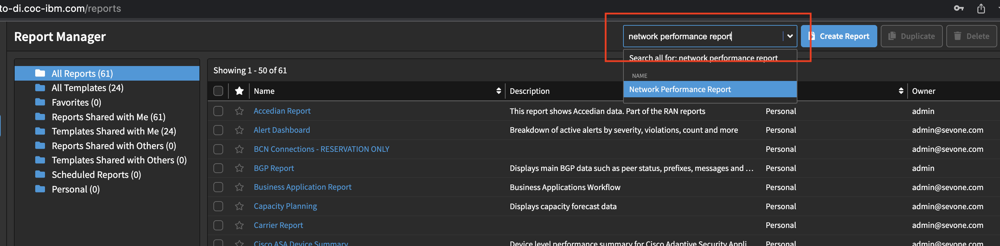

---
export const Title = () => (
  <span>
    Lab 1 - Network Performance <br />
  </span>
);
---
## Step 1: 

We will go through an example process of diagnosing high cpu usage. 

Make your way to demo.sevone.com.

Then search for Network Performance report in the top right.



Navigate to Active Alerts.

Make sure the time period is set to Past 48 Hours as shown here.


## Step 2:

Go to device groups in the top left.

Search for P1 as shown below


Now we can check out the most severe alerts.

Look for the Chicago Firewall alert and click on the CISCO summary.


## Step 3:

You will see a list of supported technologies on the sidebar. 

Select Linux from the list.


Leave the options at their default settings, and select the "Install and start as a service" option.

When you are ready, hit the Copy button to copy the one-liner to your clipboard.

## Step 4:

SSH into the training host that has been provided as “ubuntu” (your instructor will provide a host IP address and password).

```
ssh ubuntu@<IP address>
```

Paste the CURL statement that you copied in the last step into your terminal window and hit enter. 
You should see a screen that will look similar to the one below. Please enter “y” and hit enter. This will  start the installation process.


## Step 5:

Once the installation is complete, we need to validate that our work has been successful. 
To accomplish this, we will want to navigate to the Infrastructure page of the Instana UI. 

Note: You may need to refresh and give it a minute. 


When in the infrastructure map section, we will see an open text field. 
We are using DFQ or “Dynamic Focus Query” to filter the content on the screen. 

In this scenario, we will use DFQ to filter on our host using:

```
entity.host.name:<your host name> 
```


If you see your host in the map, you have validated that the installation was successful. 
