---
export const Title = () => (
  
    Lab 1 - NPM Intro  
  
);
---

## Lab Overview

This lab demonstrates how workflows works and how they can be used to go from a high level
report to a more granular one, allowing us to troubleshoot problems in a much more efficient way.

## Setting the Stage

We have a look at the most severe alerts that are active, and we see a big drop of VPN connections
on one of the firewalls. We try to correlate the drop of connections with other metrics, and we find out
that there is a correlation between drop of connections and high CPU. Reviewing the top processes
using CPU we identify that the SSL process that is the one having issues and using data analytics we
realize this is not something normal (baseline). Finally reviewing the flows (using metric to flow) we
identify a big surge of TCP SYN connections (potential DDoS attack) that is generating a high CPU
load on the SSL process, that is impacting on the VPN connections. Hence, we have identified the
root cause of the issue and the IP addresses generating the issue, therefore we can configure our
firewall or IPS/IDS to block those connection attempts.

## Step 0:

Login to the SevOne lab environment as referenced in the SevOne Lab Environment Tab
* Full Demo Video Located in the Uncut Lab Videos Tab

**Video For Steps 1 and 2:**
<video controls poster="/images/VideoCover.png" style={{ width: `50%`, height: `50%`}}>
  <source src="/videos/NPM/NetPerf1.mp4"/>
</video>

## Step 1: 

We will go through an example process of diagnosing high cpu usage. 

Search for Network Performance report in the top right.

Navigate to Active Alerts.

Make sure the time period is set to Past 48 Hours as shown here.

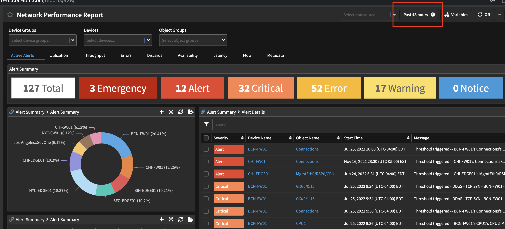

## Step 2:

Go to device groups in the top left.

Search for P1 as shown below

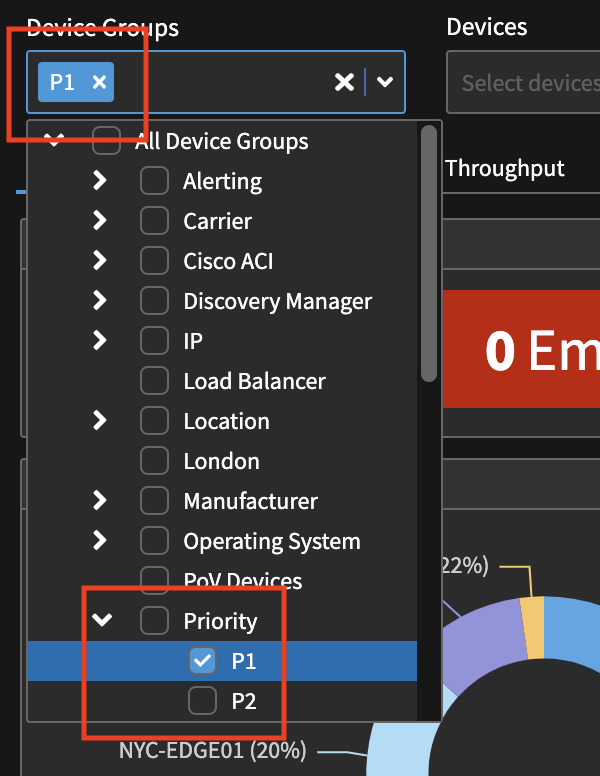

Now we can check out the most severe alerts.

Look for the Chicago Firewall alert and click on the CISCO summary.

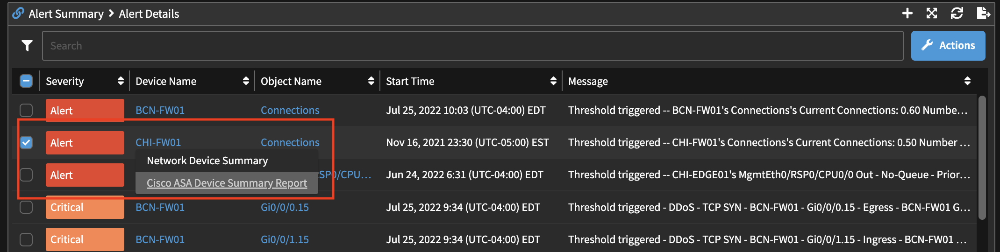

**Video For Steps 3 and 4:**
<video controls poster="/images/VideoCover.png" style={{ width: `50%`, height: `50%`}}>
  <source src="/videos/NPM/NetPerf2.mp4"/>
</video>

## Step 3:

Navigate to the connections tab and notice the drops on the graph as shown here.

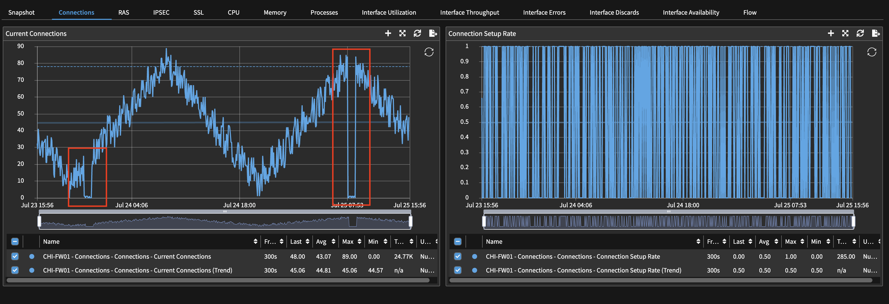

Check out some of the other tabs until you get to the CPU window. 

Notice that the cpu has similar spikes as seen before. 

Click on the graph spike and navigate to the Instant Graphs Workspace.

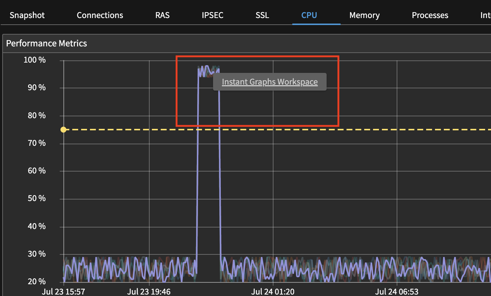

## Step 4:

Once you see the CPU screen add the connections object like so.

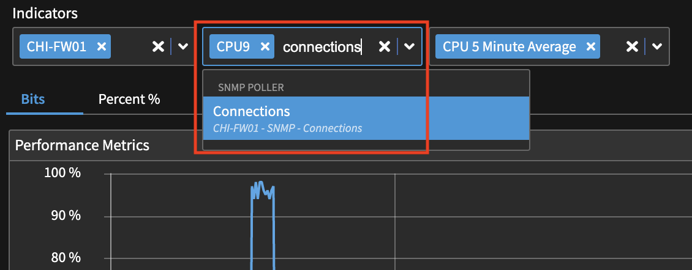

Everything will go blank, just add the 5 minute average and current connections as indicators.

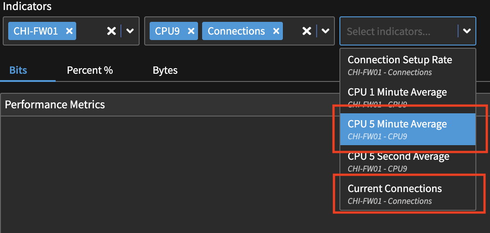

Now we can see the correlation between a drop in connections and high cpu usage.

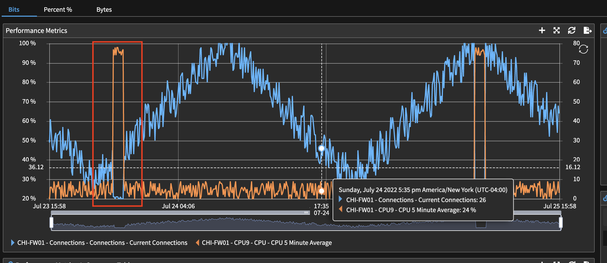

**Video For Steps 5 and 6:**
<video controls poster="/images/VideoCover.png" style={{ width: `50%`, height: `50%`}}>
  <source src="/videos/NPM/NetPerf3.mp4"/>
</video>

## Step 5:

Navigate back a page. 

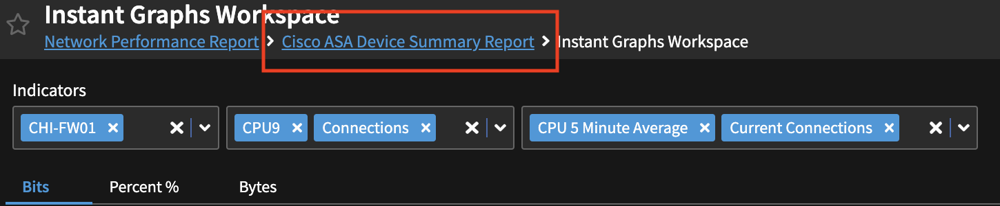

Then move over to the processes tab.

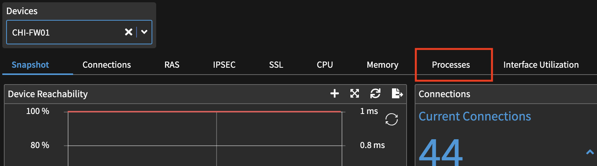

## Step 6: 

Order the CPU Time graph by max to check which process uses the most time. 

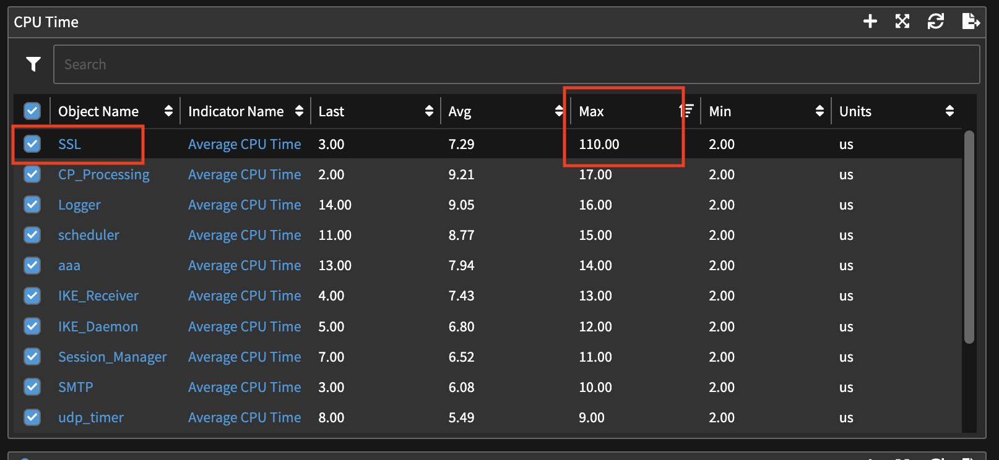

Click on the average CPU time for the SSL process

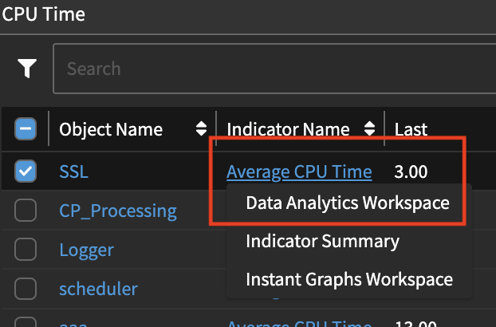

**Video For Step 7:**
<video controls poster="/images/VideoCover.png" style={{ width: `50%`, height: `50%`}}>
  <source src="/videos/NPM/NetPerf4.mp4"/>
</video>

## Step 7: 

It is evident that the spikes on the graph are not normal.

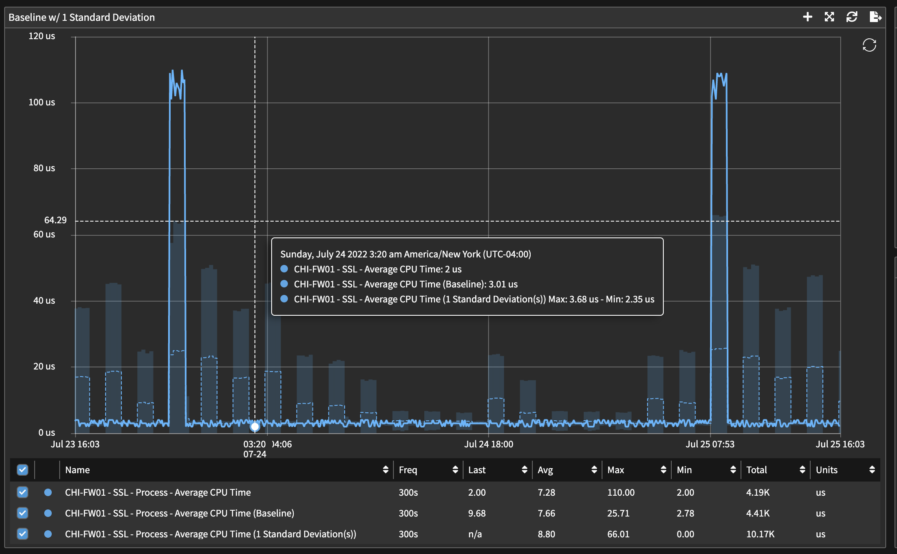

So now that we know that high cpu is generated from the SSL processes. We can
google some possible reasons for this.

Enter the following into google chrome.

After clicking on the first link we get this answer:

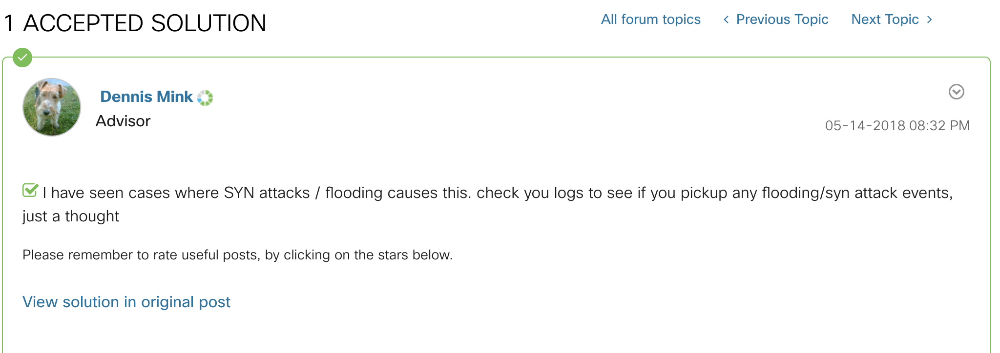

So we can see that SYN attacks could be the cause for high cpu.

Let's investigate further.

**Video For Step 8:**
<video controls poster="/images/VideoCover.png" style={{ width: `50%`, height: `50%`}}>
  <source src="/videos/NPM/NetPerf5.mp4"/>
</video>

## Step 8:

Navigate to the Flow tab at the very right.

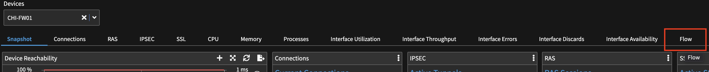

At the bottom we have a Denial of Service graph. Where we can see
a large amount of TCP/SYN packets.

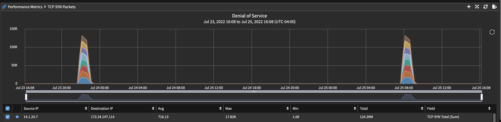

So we have found the culprit.

## Step 9:

To make sure we have the right answer, navigate to the connections tab.

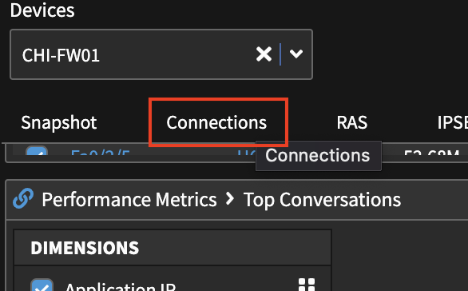

Then configure the graph as shown below.

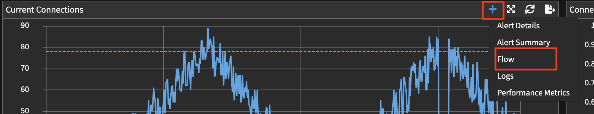

We can now see a direct correlation between the spikes and drops on both graphs.

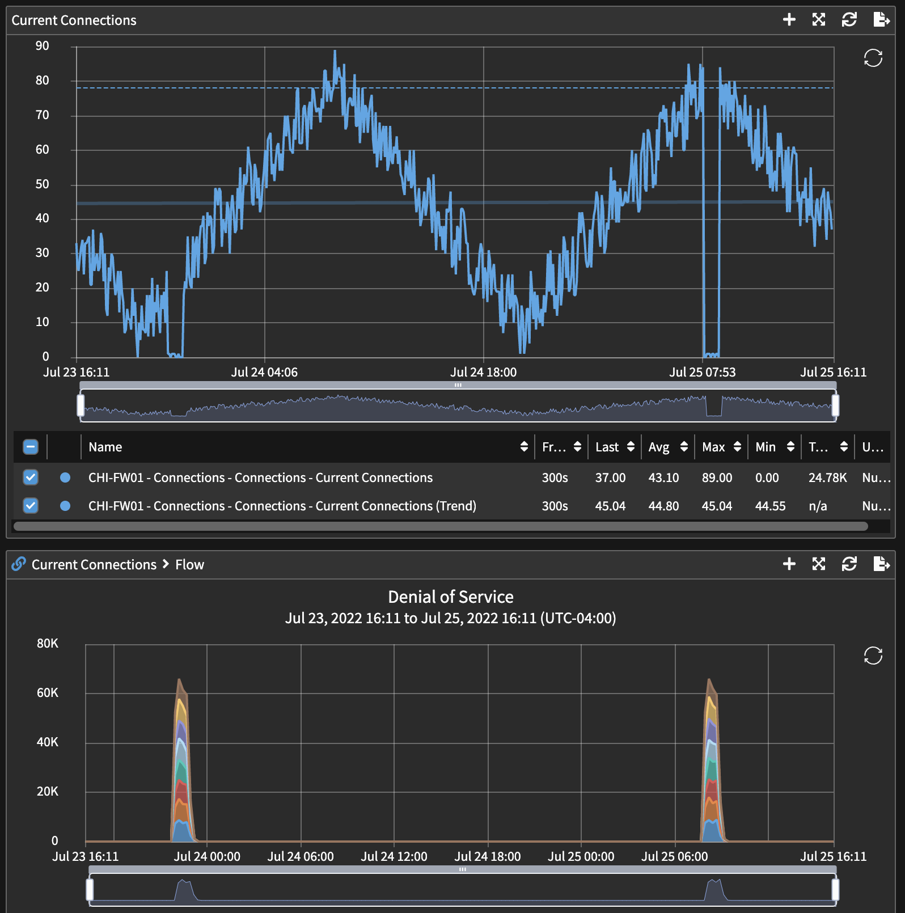

So we have determined the cause of high cpu usage.

## Summary/Additional Questions:
Instructor-Led Discussion