export const Title = () => (
  
    Lab 2 - Executive Report  
  
);
;

## Lab Overview

This lab will illustrate how SevOne can be used to provide executive dashboards that are easily 
consumed and understood that shows the current status of the enterprise network along with all 
the associated SLAs that are consisted critical to the business.

So there were some network issues reported yesterday in one if the corporate internal production 
systems. As the Network Manager starting his day, he wanted to access the tool himself to make 
sure that the issue was resolved and there are no reoccurrences of the problem since it was 
addressed and resolved.   

Also, the Network Manager wants to validate that the network is healthy and review if there are 
any SLAs being breached in any of their remoted corporate offices

## Setting the Stage

<video controls poster="/images/VideoCover.png" style={{ width: `50%`, height: `50%`}}>
  <source src="/videos/ExecRep/ExecReport1.mp4"/>
</video>

**Use Cases:**
* Service Status
  * Maps
  * Object grouping
  * Calculation Poller / Group Poller
  * Chaining
  * Workflow
* WAN Status
  * Maps
  * Calculation Poller
  * Workflow
  * Capacity Planning
* Overall Health
  * Maps
  * Chaining

## Step 0:

Login to the SevOne lab environment as referenced in the SevOne Lab Environment Tab

Full Demo Video Located in the Uncut Lab Videos Tab

## Use Case 1: Service Status

### Step 1.1:

<video controls poster="/images/VideoCover.png" style={{ width: `50%`, height: `50%`}}>
  <source src="/videos/ExecRep/ExecReport2.mp4"/>
</video>

From the SevOne homepage, open the Executive Report using the search bar.

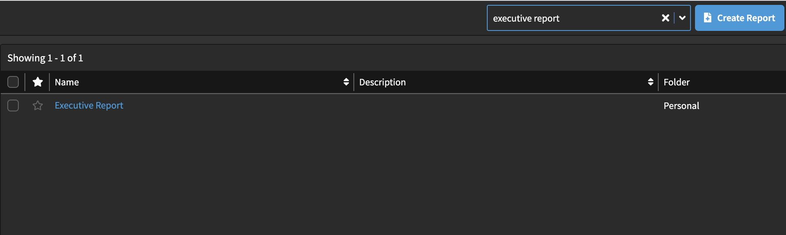

Upon entering the file, your screen should look like this:

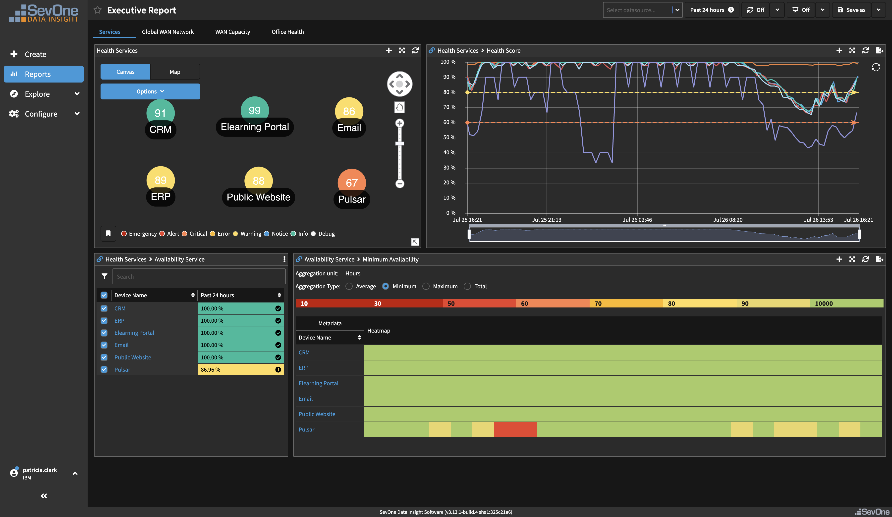

This is a dashboard to show you a big picture view of your service status. 
On the top two panels, you can see the health of your services, and on the bottom two, you can see the availability of the services.

### Step 1.2:

<video controls poster="/images/VideoCover.png" style={{ width: `50%`, height: `50%`}}>
  <source src="/videos/ExecRep/ExecReport3.mp4"/>
</video>

Focus in on the health of the services panel on the top left. As you can see, the Pulsar application is having some issues. 
Select the Pulsar icon to drill down into the service.

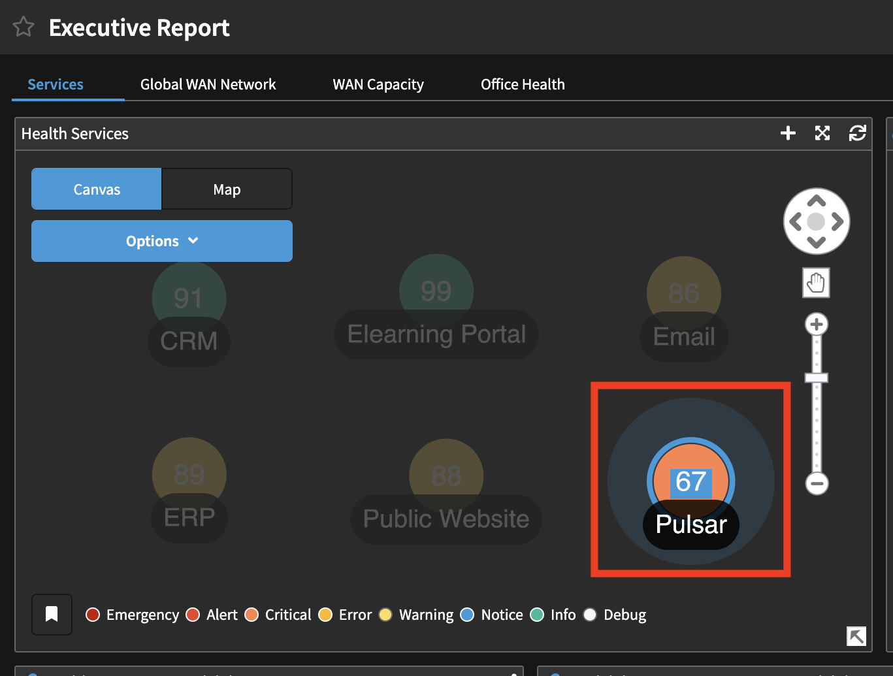

Once you select this, the dashboard becomes specific to the Pulsar application. 
If you look at the graph on the top right, you can see the times that there were problems with the service. 
The availability goes down at night, which is normal, but during the day it is a problem.

### Step 1.3:

<video controls poster="/images/VideoCover.png" style={{ width: `50%`, height: `50%`}}>
  <source src="/videos/ExecRep/ExecReport4.mp4"/>
</video>

To drill down to get more information, go to the Availability Service panel in the bottom left. 
Click Pulsar in Device Name and then select Business Application Report.

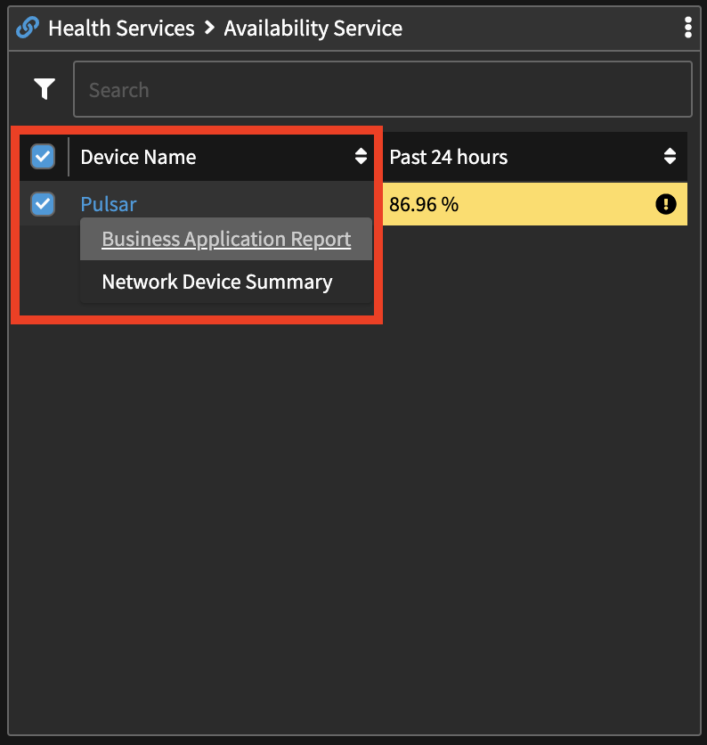

Here you can click through the different views of the application report, including Status, Availability, WAN, IPSLA, and more, depending on 
what information you are looking for exactly. Take some time to see the different views.

We are going to jump to the Traffic page.

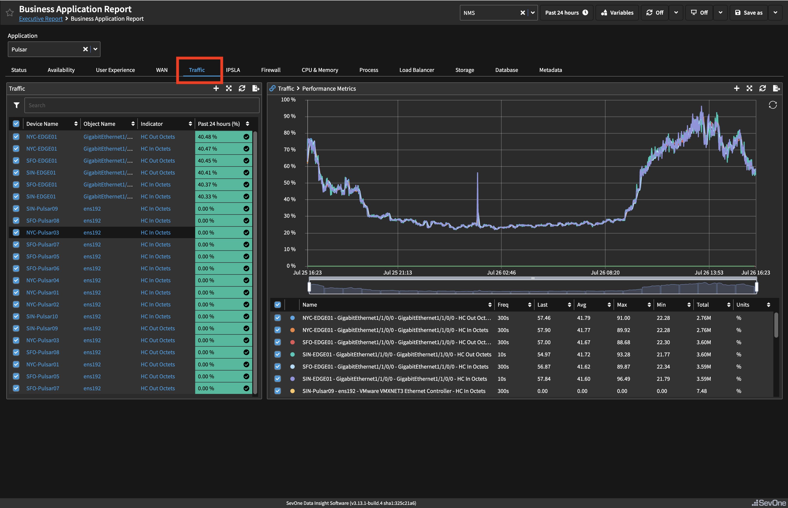

The points of high traffic utilization might explain why there was poor health during the day on this service.

## Use Case 2: WAN Status

### Step 2.1:

<video controls poster="/images/VideoCover.png" style={{ width: `50%`, height: `50%`}}>
  <source src="/videos/ExecRep/ExecReport5.mp4"/>
</video>

Now we are going to look at the system’s WAN status. 
In the upper left-hand corner, underneath the title Business Application Report, click the link to take you back to the main dashboard for the Executive Report. 
Once you’re there, click on the Global WAN Report page. 

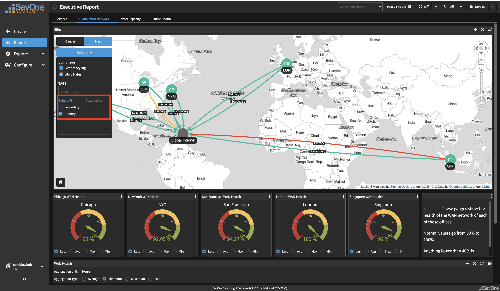

Here you can see a map of your network, where you are able to view primary and secondary connections. 
We’re just going to focus on primary connections, so you can deselect secondary.

The map will show the overall status of the WAN health for each office, as well as the status of the links. 
With the green/orange/red markers, we can easily identify if there is a problem with that office or link at that point in time.

The heatmap down below allows us to see historical data and if there was any problem in the past. 
The red blocks show problems in the past at the Chicago office.

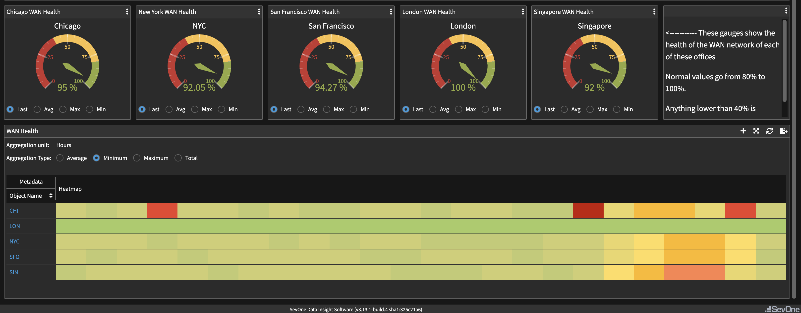

### Step 2.2:

<video controls poster="/images/VideoCover.png" style={{ width: `50%`, height: `50%`}}>
  <source src="/videos/ExecRep/ExecReport6.mp4"/>
</video>

To drill down further, click CHI in the WAN Health panel and select Global WAN Health.

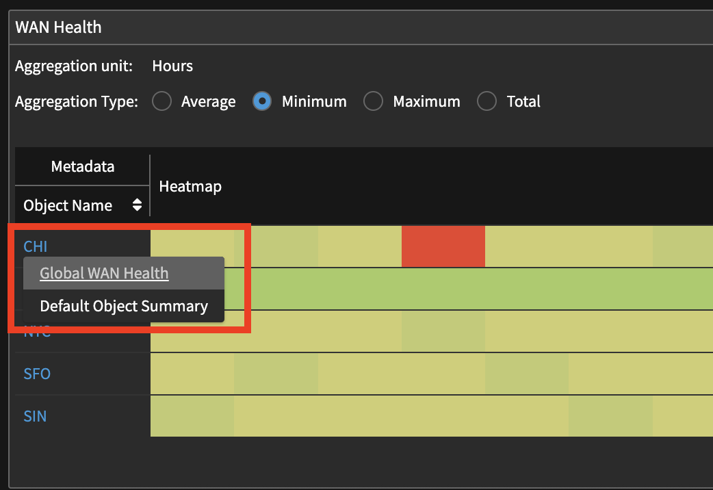

Once you do that, you view should look like this:

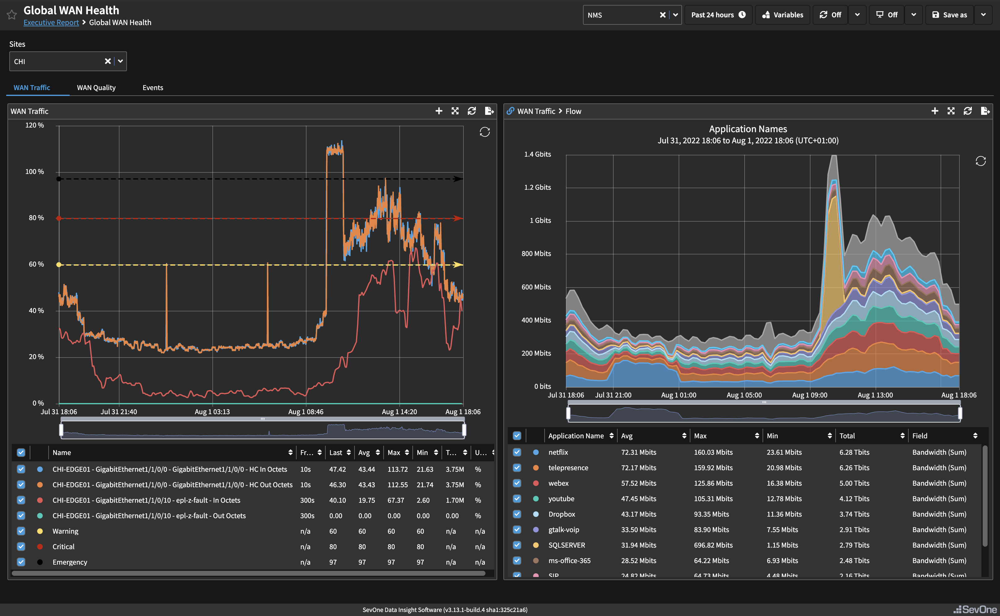

Here you get a side-by-side view of the problems in the CHI office on the left, and then the reasons for those problems on the right.
NOTE: depending on the time of the day, the applications generating spikes might be different.

### Step 2.3:

<video controls poster="/images/VideoCover.png" style={{ width: `50%`, height: `50%`}}>
  <source src="/videos/ExecRep/ExecReport7.mp4"/>
</video>

Now click on WAN Quality. Your view should look like this:

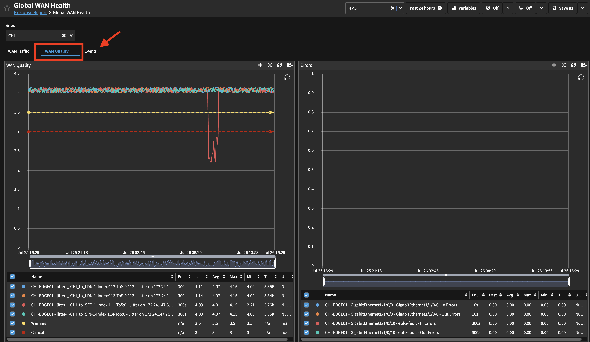

To calculate the WAN health we use several indicators, including IPSLA quality, errors, etc.
This view shows that there was also a problem with one of the IPSLA, also impacting on the health of the WAN network on that office.

To drill down even further, click on events. Your view should look like this:

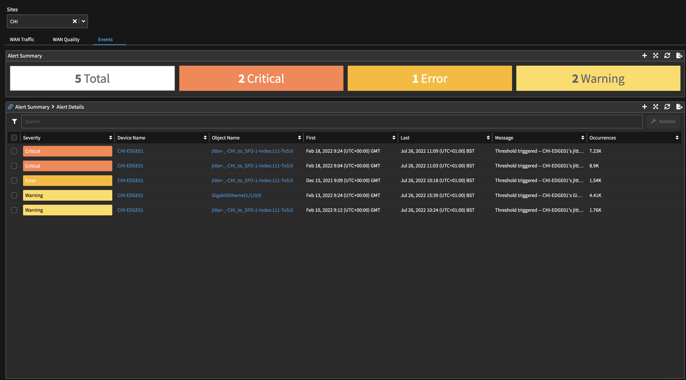

Here we can review the actual events that have happened on the WAN network of that office.

## Use Case 3: Overall Health

### Step 3.1:

<video controls poster="/images/VideoCover.png" style={{ width: `50%`, height: `50%`}}>
  <source src="/videos/ExecRep/ExecReport8.mp4"/>
</video>

The last thing we are going to do is get a view of the overall health of the network. 
Once again, click link to take you back to the main dashboard for the Executive Report, and then click WAN Capacity. 
Your view should look like this:

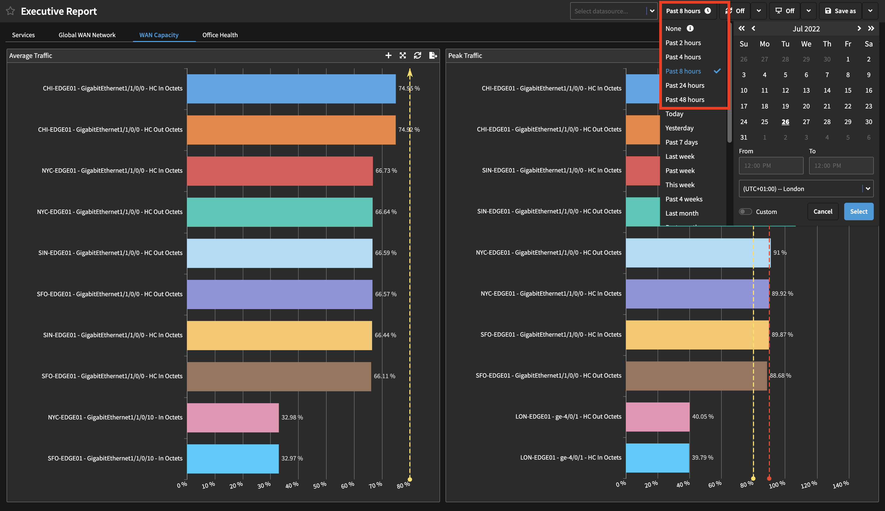

The view defaults to show you the last 24 hours, but to be even more specific, we will choose to see the last 8 hours. 
It shows the average traffic utilization as well as the peak traffic utilization in this timeframe, to help us identify any congestion.

### Step 3.2:

<video controls poster="/images/VideoCover.png" style={{ width: `50%`, height: `50%`}}>
  <source src="/videos/ExecRep/ExecReport9.mp4"/>
</video>

Now look at Office Health.

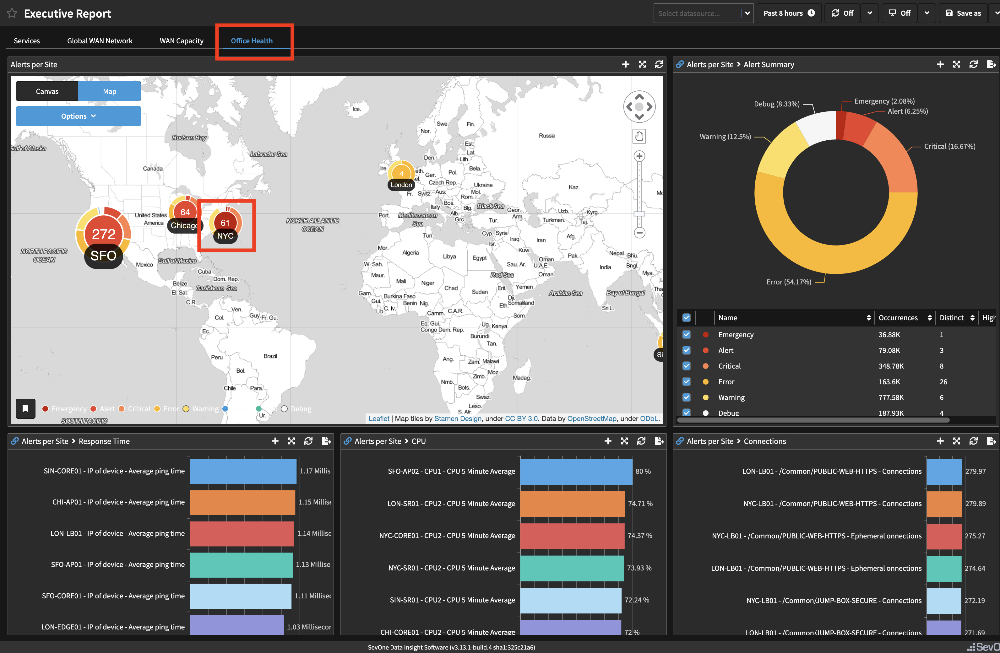

Here you can see a high-level view of the number of events per office, giving you an idea of which regions are having more problems that the others. 
It also shows top devices by response time, CPU, and connections, giving us an idea of how busy the devices are.

Click in on one of the offices to see the widgets propagate the data specific to that location.

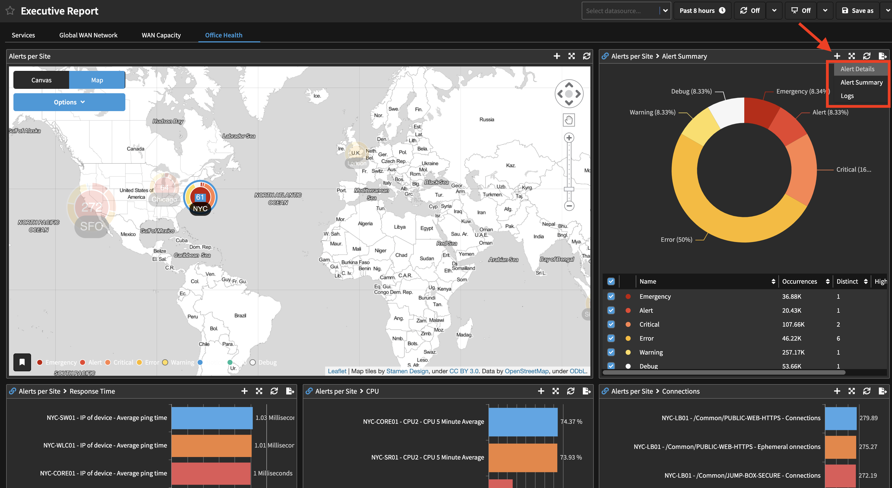

We now have seen a broad view of the capabilities of SevOne to show you your network health.

## Summary/Instructor-Led Discussion:

<video controls poster="/images/VideoCover.png" style={{ width: `50%`, height: `50%`}}>
  <source src="/videos/ExecRep/ExecReport10.mp4"/>
</video>

