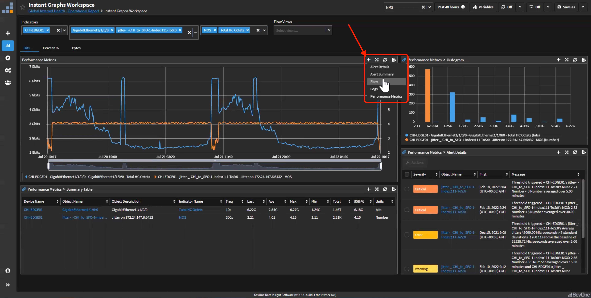

export const Title = () => (
  
    Lab 2 - WAN Health  
  
);
;

## Lab Overview

This lab will show how we can monitor the internet connections from a holistic
approach, not only monitoring internet traffic, but getting visibility from every single aspect of
the network that could impact the internet connections, from BGP connections to MPLS traffic,
from QoS drops to bandwidth analysis

## Setting the Stage

Recently there have been some issues with MS Teams; however, in the past it has been very
difficult to troubleshoot these problems. Now, the company deployed SevOne and we are
trying to identify the root cause of the MS Teams issue. Reviewing every single KPI that can
impact that application, we will find out why the issue occurred and how to fix it.

**Use Cases:**
* All the Data 
  * Maps – data simplification 
  * Object groups 
  * Routing protocols – Device certification 
  * Network quality 
  * Netflow – bandwidth analysis 
  * QoS – Device certification 
  * MPLS – Device certification 
* Backup Issue - Data Correlation 
  * Metric to flow 
  * Workflow 
* MS Teams Issue - Root cause analysis 
  * High Frequency Polling 
  * Baseline 

## Step 0:

Login to the SevOne lab environment as referenced in the SevOne Lab Environment Tab

Full Demo Video Located in the Uncut Lab Videos Tab

## Step 1:

<video controls poster="/images/VideoCover.png" style={{ width: `50%`, height: `50%`}}>
  <source src="/videos/WAN/WANVideo02.mp4"/>
</video>

Go to Global Internet Health - Operational Report. Switch the timeframe to view the last 48 hours.

Here we will see how we can monitor internet connections from a holistic point of view. 

* Internet monitoring is not only traffic monitoring and errors, it is more than that 
* This reports shows everything that might be relevant to troubleshoot WAN issues 
* Change location easily using Sites filter (object group) 
* Easy visualization using Maps and chaining 

## Step 2:
<video controls poster="/images/VideoCover.png" style={{ width: `50%`, height: `50%`}}>
  <source src="/videos/WAN/WANVideo03.mp4"/>
</video>

Go back to the main page and focus on Issue: 

The main page displays a consolidated list of issues that take place relating to the network health,
categorized by warnings, errors, alerts, and critical tags.

* Talking Points: 
  * Some issues with IPSLA (link performance) have been identified 
  * These issues might or might not be related to the MS teams problem 
  * Time to start troubleshooting and correlate data 

## Step 3:
<video controls poster="/images/VideoCover.png" style={{ width: `50%`, height: `50%`}}>
  <source src="/videos/WAN/WANVideo04.mp4"/>
</video>

Go to Quality and Reachability section: 

* Talking Points: 
  * There are some problems with MOS and Jitter at the same time 
  * We can give indications of the meaning of the KPIs within the report (see Explanation widget) 
  * The question is why is this happening? 

## Step 4:
<video controls poster="/images/VideoCover.png" style={{ width: `50%`, height: `50%`}}>
  <source src="/videos/WAN/WANVideo05.mp4"/>
</video>

Go to Internet Connections

The internet connections tab provides visibility into time-based correlations for potential issues, adding a layer of context to network analysis.
* Talking Points: 
  * There is a spike of traffic that looks like it is at the same time as the issues with performance 
  * We need to make sure these two issues are related 

Click on HC Out Octets within the Traffic widget. Go to Instant Graph Workspace 

* Choose
  * Device: CHI-EDGE01 (Already selected)
  * Objects: Objects: GigabitEthernet1/1/0/0 (Already selected), and jitter -_-CHI_to_SFO-1-Index:111-Tos:0 (Hint: start typing in “SFO” to find)
  * Indicators: Total HC Octets and MOS 

* Talking Points: 
  * Very easy to see that both issues are correlated 
  * Because of the saturation of the link, the quality of the link drops 
  * But we still need to know why there is saturation 

## Step 5:
<video controls poster="/images/VideoCover.png" style={{ width: `50%`, height: `50%`}}>
  <source src="/videos/WAN/WANVideo06.mp4"/>
</video>

Click + (in the Performance Metrics window) and select Flow 

Change Flow view to Application Names 

* Talking Points: 
  * The ability to link metric with flow data allows us to easily identify that the problem is the spike of SQL traffic 
  * Hence, we have identified one issue, but this does not look related to the original MS Teams issue that we were reviewing 

## Step 6:

Click on Global Internet Health – Operational Report breadcrumb to go back to the main report 

<video controls poster="/images/VideoCover.png" style={{ width: `50%`, height: `50%`}}>
  <source src="/videos/WAN/WANVideo07.mp4"/>
</video>

Review QoS alert 

* Talking Points: 
  * There is a problem with a priority QoS class having drops 
  * We are not generating alerts on every single class, only on those ones that are important/critical 
  * Let’s review the impact of this alert 

Go to QoS sections

Go to Internet Connections section. 

* Talking Points: 
  * There is a spike of priority class traffic that is generating some drops 
  * There are also some drops related to best effort traffic that are not relevant 
  * We need to identify what kind of traffic is generating that spike 

## Step 7:
<video controls poster="/images/VideoCover.png" style={{ width: `50%`, height: `50%`}}>
  <source src="/videos/WAN/WANVideo08.mp4"/>
</video>

Go to BW Analysis section.

* Talking Points: 
  * At the time of the issue there is an application that generated more traffic than normal 
  * Let’s identify that application 

Select MS Teams

* Talking Points: 
  * There is a short term spike of MS Teams traffic that may have generated the issue as it may have reached the max BW assigned to the QoS class assigned 
  * However we need more detailed information, because microburst could be another reason why there are QoS drops 

## Step 8:
<video controls poster="/images/VideoCover.png" style={{ width: `50%`, height: `50%`}}>
  <source src="/videos/WAN/WANVideo09.mp4"/>
</video>

Go to Internet Connections  

Zoom in on the time of the spike (as much as possible) 
* Talking Points: 
  * Using our high frequency polling we can detect short term bursts of traffic, giving us more detailed information that would be missed if we were monitoring every 5 minutes 

Click on HC In Octets and choose Instant Graphics Workspace

* Talking Points:
  * We are able to compare the microburst of these two sites and see that CHI and SFO are not seeing the same results
  * We can see this level of granularity to help us identify this problem in only a few minutes.

* Choose:
  * Device: CHI-EDGE01 and SFO-EDGE01 (hint: start typing SFO-ED)
  * Objects: GigabitEthernet1/1/0/0 (CHI) and GigabitEthernet1/1/0/0 (SFO) (hint: start typing 1/1/0/0)
  * Indicators: Total HC Octets (CHI) and Total HC Octets (SFO) (Hint: start typing Total HC)

## Step 9:
<video controls poster="/images/VideoCover.png" style={{ width: `50%`, height: `50%`}}>
  <source src="/videos/WAN/WANVideo10.mp4"/>
</video>

Click on HC In Octets (for CHI-EDGE01) and choose Data Analytics

* SevOne can tell us the normal behavior of any monitored metric 
* Here we can see that the microburst is not normal, but the SQL traffic that we saw before actually happens every day 

## Summary/Additional Questions:
Instructor-Led Discussion