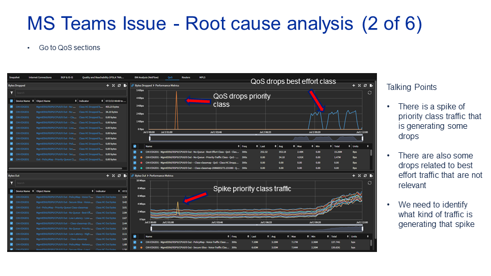

---
export const Title = () => (
  
    Lab 3 - WAN Health  
  
);
---
## Link to the Video: 
https://ibm.box.com/s/9imargrlkkyw4d229sosovbeogna3gsi

<video controls poster="images/sevone.png" style={{ width: `50%`, height: `50%`}}>
  <source src="/videos/IBM SevOne NPM WAN Health Demo.MP4"/>
</video>

## Step 1:

## Step 2:

## Step 3:

