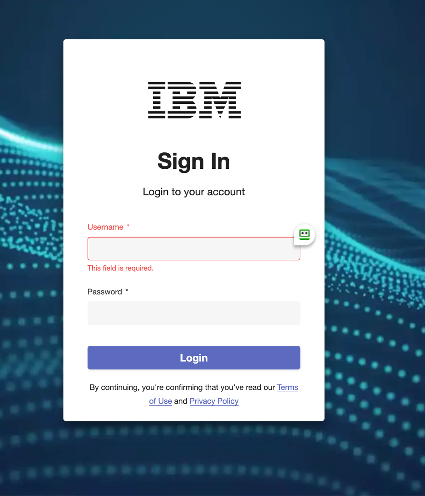
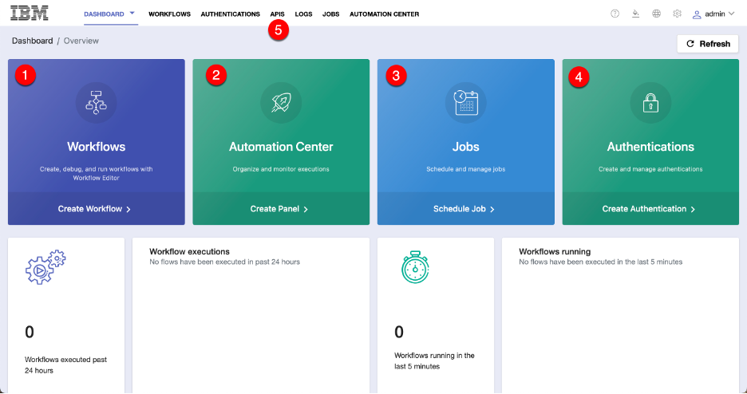
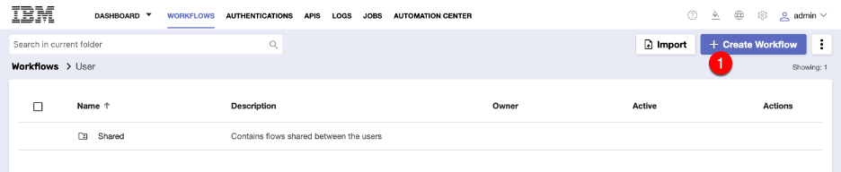
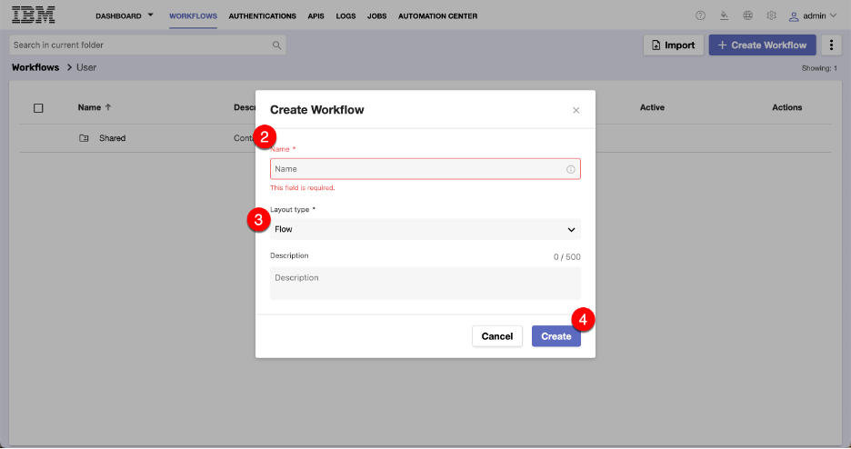
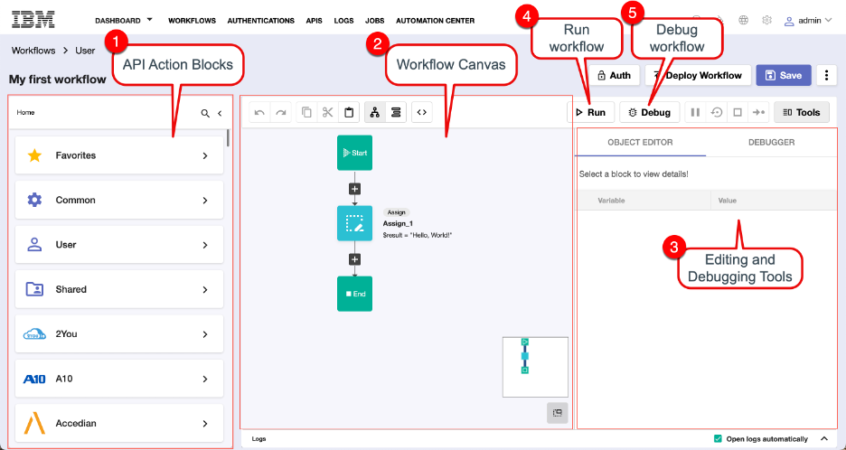
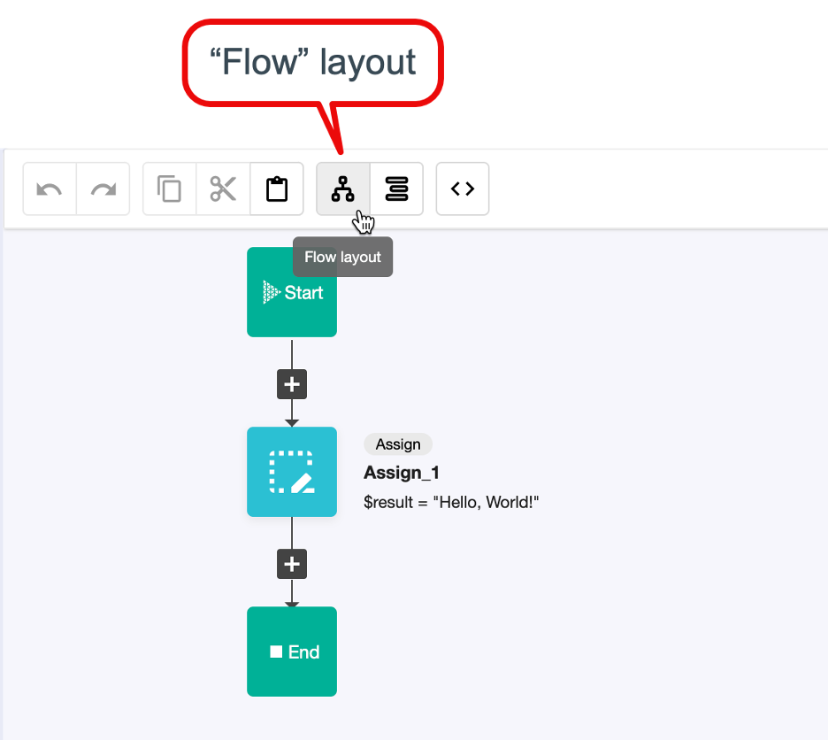
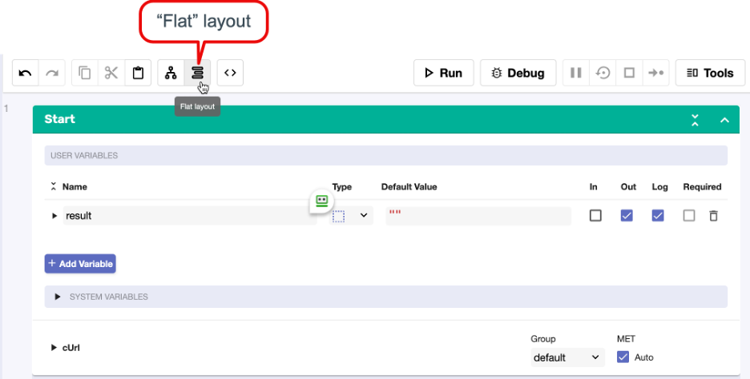
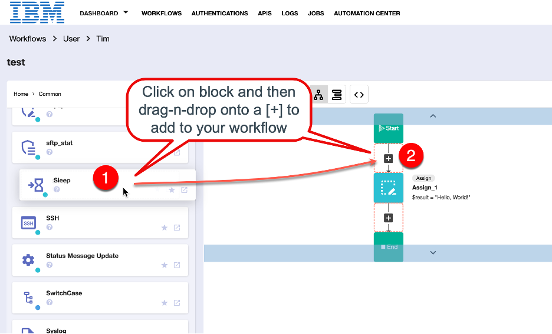
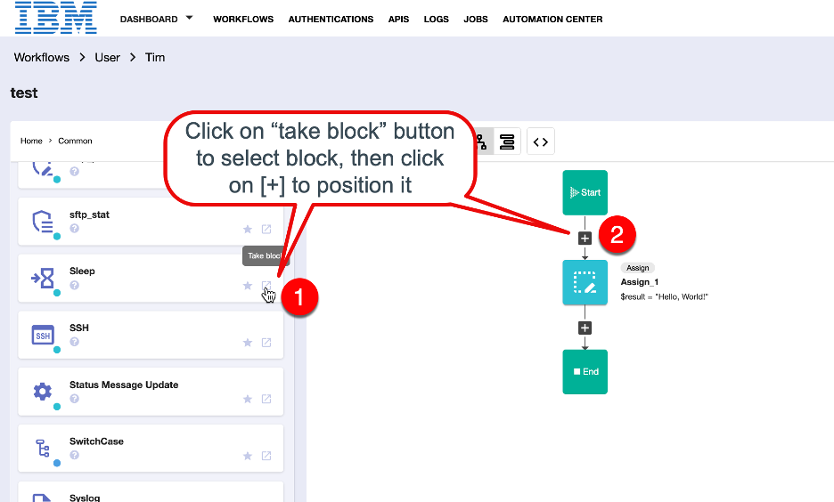
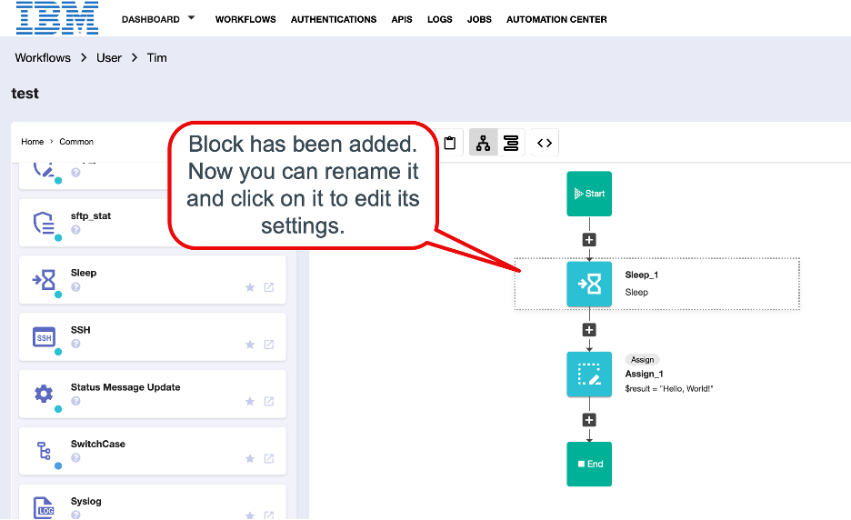

export const Title = () => (
  
    RNA Lab 1 - Primer/Intro Lab  
  
);
;

## Lab Overview

This lab will provide an overview of how the IBM Rapid Automation Workflow Editor works.

## Login

Initially you are presented with a login screen.

Go ahead and login.

## Initial Dashboard

Once you login, you will see the Dashboard.
There are four large colored tiles for the main options, plus a menu bar at the top to access all possible options.

### Main Options

  1. Workflows: Here's where you define your workflows and do your "low code/no code" development (run, debug).
  2. Automation Center: Once you've defined a workflow, you can create easy-to-use tiles for end-users to run the automations.
  3. Jobs: Workflows can be scheduled to run here.
  4. Authentications: You define your security authentication credentials for the APIs you will be using here.
  5. Apis: You can run your workflow as an API endpoint by defining it here.

## Creating a new workflow

Navigate into the Workflows editor by pressing the "Workflows" tile or by selecting it from the top menu.

1. Once in the editor, you can press the [+ Create Workflow button] to create your very first workflow.

2. In the "Create Workflow" form, give your workflow a name
3. Select the layout type. You can leave the layout type set to "Flow" for now. We will discuss layout types later on.
4. Finally press the [Create] button.

## Viewing your workflow

The "Workflow Editor" appears.

1. On the left section of the screen, you see the palette of various APIs containing their API endpoint "Action Blocks".

<InlineNotification>

You can click on the magnifying glass to search for specific Vendor APIs and endpoints (e.g. Search for "SevOne")

</InlineNotification>

2. In the middle section, you see the workflow canvas, where you can drag-and-drop API action blocks to form your workflow.
3. The "Tools" section on the lower right may not be visible to you initially, but will appear if you press the [Tools] button above it, or by double-clicking on one of the action blocks in the canvas.
4. The [Run] button is used to test your workflow.

<InlineNotification>

Running your workflow helps you make sure your syntax and logic is correct. It will cause the "Logs" panel at the bottom of the screen to be populated with helpful debug information if something isn't right.

</InlineNotification>

5. The [Debug] button allows you to step through your workflow using "breakpoints" that you set on action blocks of interest.

## Viewing layouts

At the top of the workflow canvas panel, there are two buttons that allow you to toggle between viewing layouts:

- Flow layout OR Flat (Sequence) layout

*Flow Layout*

"Flow layout" is a more compressed way of viewing your workflow. Action blocks are displayed in a flowchart-like manner, allowing you to click on them to edit their settings in the "Tools" panel on the right of the workflow canvas. You can also drag-and-drop other API action blocks on top of the [+] connectors between the existing action blocks in order to build out your workflow to get the result you are after.

*Flat (Sequence) Layout*

"Flat layout" is an expanded layout that makes it easier to configure certain action block settings, such as value fields. All of the blocks are displayed in flat layout mode in sequential order, allowing you to scroll to the block you want to see its settings.

## Workflow Basics

### Defining a Workflow

Workflows are defined using Action Blocks that are arranged in order to accomplish the designed task. As blocks are dragged onto the workflow canvas, they can be renamed in order to help self-document the purpose of a particular block.

There are two ways to add a block to your workflow:

  - Drag a block into your workflow canvas, dropping it on a '+' connector
  - Use "Take a Block" button to select the block, then click on '+' connector to position it

*Drag a Block:*

*Take a Block:*

*Your Result:*

### Variables

  - Variables are defined in the Start Block for use within the life of the workflow.
  - Each variable has a name (e.g. myVariable) and a value.
  - You can assign a default value at variable creation time that can be overridden later if needed.
  - Once you create a variable, you can access its value by adding a "$" to the start of the variable name (e.g. $myVariable would contain the value of the variable "myVariable" that I had defined earlier.)
  - Block names become variable names, allowing you to access the results of the processing of that block. If I have a block called "SevOne-Alerts_1", once it executes, its results are passed to the next block using the variable-ized block name with a .result appended to it (e.g. $SevOne-Alerts_1.result).

## Block Types 

Blocks take input from the Start block variables or from the previous block in the flow.

### Start Block

The "Start" block is where the workflow begins. You define a number of items here:

  - the input and output variables that you use during your flow,
  - whether the input fields are required or not,
  - the "type" of the field (e.g. string, number, array, custom, authentication, etc),
  - whether to log the results, displaying the values at the end of the workflow run.

<InlineNotification>

The input variables become the URL key/value pairs that are populated during API calls of your workflow.

</InlineNotification>

### Common Action Blocks

On the left panel of your Workflow Editor screen, you will see the API action block palette. There are groups of API "utility" endpoints listed within the "Common" API option. Click on the "Common" option to see them.

These APIs are used for:

  - data formatting and handling
  - handling processing logic such as "if/then", while, forEach, case handling
  - assigning values
  - providing comments
  - formatting results
  - exception handling
  - and much more!

### User Action Blocks

You are able to re-use workflows that you may have defined before within an existing workflow. This is referred to as using "sub-flows". Sub-flows allow you to break-up the logic of complex workflows into smaller flows, making them easier to construct, understand and maintain. When a subflow is called by a main workflow, from a licensing perspective, it does not count against your licensed flow count.

### Shared Action Blocks

Action blocks that are shared with you can also be added to an existing workflow, allowing you to collaborate with others when creating workflows.

### Vendor API Action Blocks

In the API Palette, if you scroll below the Common, User, and Shared options, you will find the many Vendor APIs and their action blocks that have been certified within the platform. Rather than having to scroll down the rather long list, you can "Search" for a particular vendor using the magnifying glass at the top of the API palette (e.g. search for "SevOne").

<InlineNotification>

Here is where Authentications come in. In order to use a third-party API, you must configure the login requirements and credentials in the Authentications section of the IBM Rapid Network Automation UI.

</InlineNotification>

### Finish Block

The finish block denotes the end of the workflow. When the finish block is hit, it will dump out the "result" of the workflow to the "log" panel if it is selected, or the $result value is provided to standard-out upon workflow completion.

