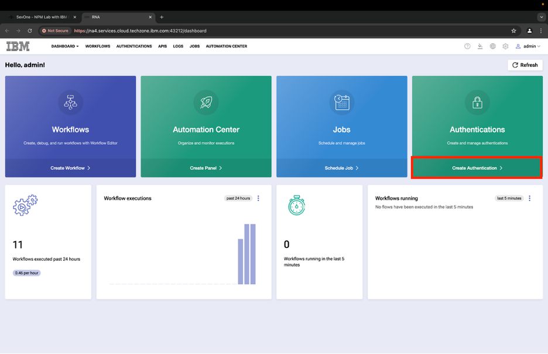

export const Title = () => (
  
    RNA Lab 2 - Logic Lab  
  
);
;

## Step 1: 
First we need to create authentication to connect to NMS. Begin by clicking on “Create Authentication” once you login to the dashboard.

In the top right corner, press the purple rectangle labeled “Create Authentication”.

- Name: NMS_connect
- Description: *leave blank*
- Service: SevOne
- Protocol: https://
- Host: 10.0.0.10
- Username: admin
- Password: SevOne
- API key: *leave blank*

Click "create"

## Step 2: 
Navigate to the “WORKFLOWS” tab at the top of your screen to the left of your current tab, “AUTHENTICATIONS”. Then, click “Create Workflow” in the top right corner.

Title the workflow “Lab2” and keep the Layout type as “Flow”. You can leave the description blank and press “Create”. 

## Step 3:
Let’s add our first building block. Do this by first navigating to the left-hand menu, scrolling down until you see “SevOne”, and select. The flow should be [ SevOne > RESTv3 > Metadata > Metadata Devices (POST) ]

You’ll need to change the authentication key to the one we created in Step 1. Once you’ve added your first block, select “admin/NMS_connect” from the dropdown next to “authKey”.

## Step 4:
Now, add a ForEach loop after the SevOne block we just made. Select “Home” at the very top of the left-hand navigation bar to return to the initial menu. Select [ Common > ForEach] and add the block.

Once you’ve added your ForEach block, edit the value next to the variable “list” to be $SevOne_1.result.devices 

*If you changed the name of the building block, please use the current name for the variable.*

## Step 5:
Inside the loop, let’s add an IF building block. To do this, navigate back “Home” on the toolbar and select [ Common > If ] and add the block.

The condition will be: $ForEach_1.item.ip == ‘127.0.0.1’

*Be sure to write it manually — it may give you an error if you try and copy and paste the conditon into the value box.*

## Step 6:
Inside the TRUE branch of the If, add a new building block by selecting [ Common > Assign ] and dragging it under the TRUE branch.

You can either add a new Assign block or move the one below it already in your flow (Assign_1) and modify it, like it's shown here.

The variable will be: $result | The value will be: $ForEach_1.item.name 

## Step 7:
Save and Run the workflow. The expected result: “NMS”

[Optional] Try a different criteria to search inside the If — change the IP address from “127.0.0.1” to “172.24.148.2”. The expected result: “CHI-SW01”
