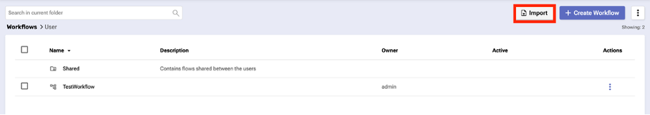

export const Title = () => (
  
    RNA Lab 3 - Metadata Lab  
  
);
;

## Step 1: *Skip if already done in previous labs*
First we need to create authentication to connect to NMS. Begin by clicking on “Create Authentication” once you login to the dashboard.

In the top right corner, press the purple rectangle labeled “Create Authentication”.

- Name: NMS_connect
- Description: *leave blank*
- Service: SevOne
- Protocol: https://
- Host: 10.0.0.10
- Username: admin
- Password: SevOne
- API key: *leave blank*

Click "create"

## Step 2:
Download from the community “Self-Service Data ingestion” zip file. If it’s not downloading as a zip file, be sure to try another browser such as Chrome. 

#### https://community.ibm.com/community/user/aiops/viewdocument/sevone-data-ingestion-api-v3?CommunityKey=fe9d91df-352c-4846-9060-189fd98d00ca&tab=librarydocuments
(Scroll down to the attachments section for download)

Import the workflow (original .zip file, no need to uncompress it).

The workflow should be listed as “SevOne Ingest Data - APIv3”.

## Step 3:

Create a new workflow like we did previously (click “Create Workflow”) and name it “Lab3”. 

- Navigate to [ Home > User > “SevOne Ingest Data - APIv3” ] and drop it under the Assign_1 block
- Rename this block from “User_1” to “toSevOne”
- Change the content to be $Body (the variable will be created later)
- Update the NMSCredentials with the authentication we previously created (NMS_connect)

## Step 4:
Assign a variable to be inserted into SevOne.

- From Flat Layout. Create a new variable “Body”, Object, and empty {} (check box for Out & Log)

Modify the module “Assign_1”​

- Variable: $Body   ​
- Value: (SEE TEXT BELOW)

Text to cut and paste - You will need to realign: 

{
    "Sacramento02": {
        "Speedtest": ["Values", {
            "timestamp1": {
                "timestamp": 1720047251,
                "Download": [999, "Megabits", "GAUGE"],
                "Upload": [967, "Megabits", "GAUGE"]
            }
        }]
    }
}

*This is just sample data. This example adds a new device "Sacramento02" and an object "Speedtest"*

## Step 5:
Add a completion message once the workflow is completed [ Home > Common > Assign ] and drag it under the toSevOne block (Assign_2).

- Variable: $result
- Value: “Insert to SevOne completed!”

## Step 6:
Execute and validate the workflow result.

- Then hit save and run.

This should be your result inside RNA:

Verify your results in SevOne(NMS) as well:
#### Use the link provided by the instructor to access your RNASevOne Lab Environment instance. (ID & PWD: admin/SevOne)

Devices > Device Manager > “Sacramento02” > Edit this device > Object Manager > Speedtest   (can take few minutes to reflect this data)

