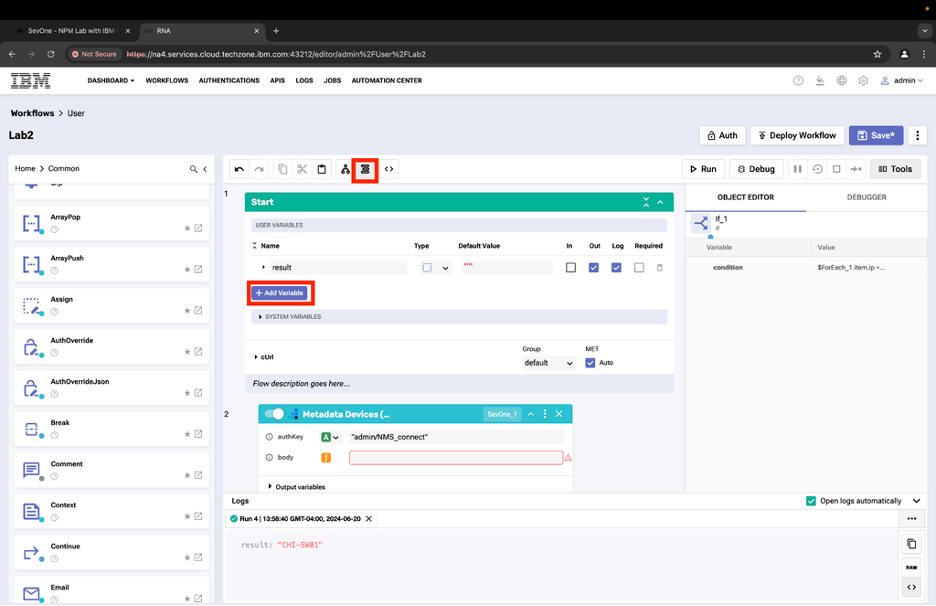
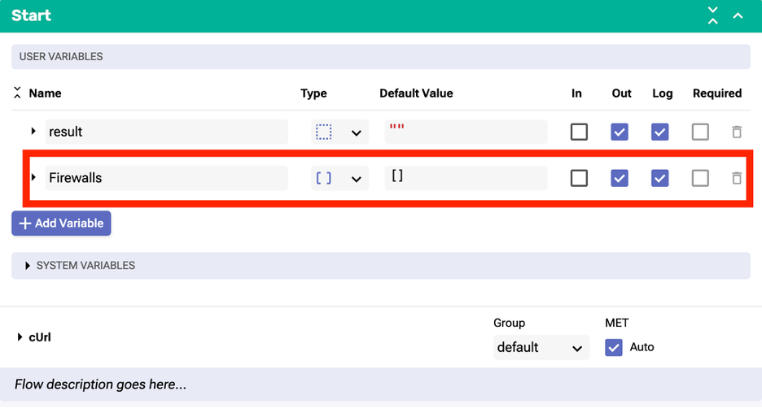
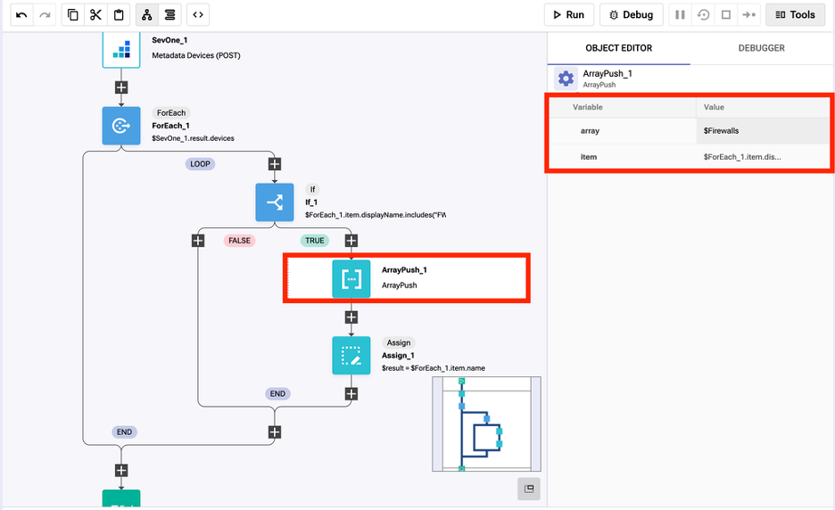
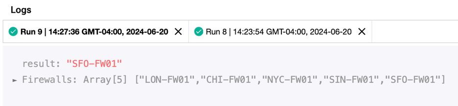

export const Title = () => (
  
    Logic Lab - Bonus  
  
);
;

## Step 1: 
Use the same workflow Lab2 or you can clone it as Lab2B.

## Step 2: 
Select “Flat Layout” to add a new variable called “Firewalls”. 

Set the type to [ ] Array and check the boxes for Out and Log. 

## Step 3: 
Change the logic inside the If_1 to find all devices that contain “FW” in their name. You can go back to Flow Layout to do this for easier visibility.

Set the condition to: $ForEach_1.item.displayName.includes(‘FW’)

## Step 4: 
Inside the TRUE branch of the If block, add a new building block called ArrayPush_1. Do this by navigating to [ Common > ArrayPush ] and dropping the block above Assign_1.

Array: $Firewalls
Item: $ForEach_1.item.displayName

## Step 5: 
Save and run the workflow. The expected result is “Firewalls: Array [5]” with a list of 5 devices. 
