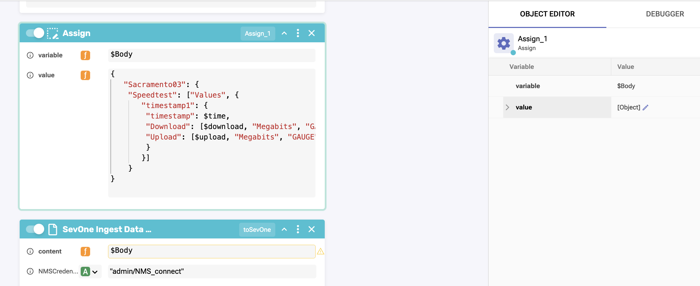

export const Title = () => (
  <span>
    Metadata Lab - Bonus <br />
  </span>
);
;

## Step 1: 
Use the same workflow Lab3 or you can Clone it as Lab3-Bonus.

To clone Lab3 workflow execute the following:
- Workflows > User 
- Select "Actions" on the right and select "Clone"
- Enter new name "Lab3-Bonus"


## Step 2:
Create 3 variables to be inserted into SevOne using the Flat Layout. 

- Create a new variable “time”, Number, and 0.
- Create a new variable “upload”, Number, and 0.
- Create a new variable “download”, Number, and 0.


## Step 3:
Assign the time automatically using a predefined function. 

- Add the function to the flow after the Start block by navigating [ Home > Common > DateTime > Timestamp Now ] and dragging it into the flow
- Under the block we just made, edit the existing Assign block and name it something meaningful - “Assign_Time”
- Change the existing values to:
   - Variable: $time
  - Value: $TimestampNow_1.result


## Step 4:
Assign a random value to download variable, with JavaScript.

- Add a “Function” to the flow, after ”Assign_Time” [ Home > Common > Function ]
- Inside the Function, Object Editor, copy and paste this JavaScript code.
   - $download = Math.floor(Math.random() * 1000) + 10


## Step 5:
Assign a random value to upload variable, with JavaScript.

- Add a “Function” to the flow, after the previous Function [ Home > Common > Function ]
- Inside the Function, Object Editor, copy and paste this JavaScript code.
    - $upload = Math.floor(Math.random() * 1000) + 10


## Step 6:
Add a new "Assign" block after the Function_2 "Upload" 

- Variable: $Body   
- Value: (SEE TEXT BELOW)




Text to cut and paste - You will need to realign: 
```
{
   "Sacramento03": {
	"Speedtest": ["Values", {
	   "timestamp1": {
		"timestamp": $time,
		"Download": [$download, "Megabits", "GAUGE"],
		"Upload": [$upload, "Megabits", "GAUGE"]
		}
	   }]
	}
}
```
(NOTE: We changed the Device Name from the previouse example to assist with identifying the results faster. Note the difference on this lab, we are assigning variable instead of manual values.)


## Step 7:
Execute and validate the workflow result.

- Then hit save and run.


This should be your result inside RNA:


Verify your results in SevOne(NMS) as well:
#### Use the link provided by the instructor to access your RNASevOne Lab Environment instance. (ID & PWD: admin/SevOne)


Devices > Device Manager > “Sacramento03” > Edit this device > Object Manager > Speedtest   (can take few minutes to reflect this data)


