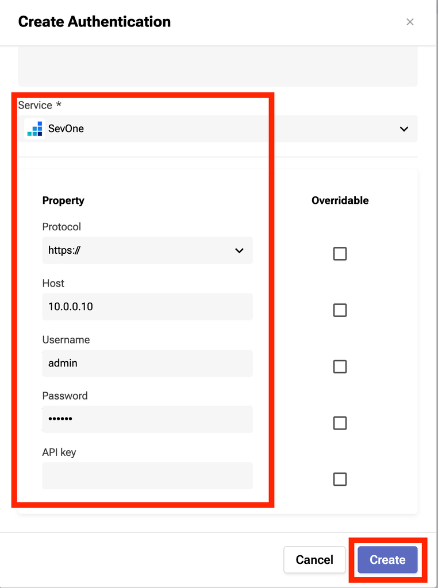
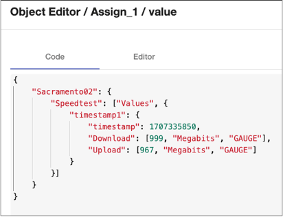
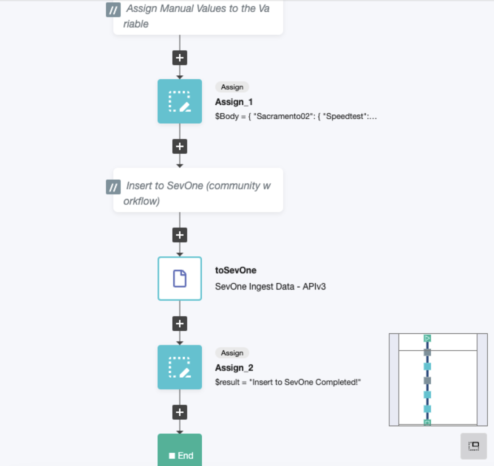
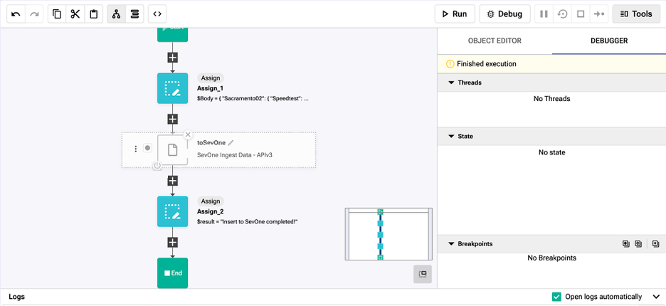

export const Title = () => (
  
    Metadata Lab - Bonus  
  
);
;

## Step 1: *Skip if already done in previous labs*
First we need to create authentication to connect to NMS. Begin by clicking on “Create Authentication” once you login to the dashboard.

In the top right corner, press the purple rectangle labeled “Create Authentication”.

- Name: NMS_connect
- Description: *leave blank*
- Service: SevOne
- Protocol: https://
- Host: 10.0.0.10
- Username: admin
- Password: SevOne
- API key: *leave blank*

Click "create"

## Step 2:
Download from the community “Self-Service Data ingestion” zip file. If it’s not downloading as a zip file, be sure to try another browser such as Chrome. 

#### https://community.ibm.com/community/user/aiops/viewdocument/sevone-data-ingestion-api-v3?CommunityKey=fe9d91df-352c-4846-9060-189fd98d00ca&tab=librarydocuments
(Scroll down to the attachments section for download)

Import the workflow (original .zip file, no need to uncompress it).

The workflow should be listed as “SevOne Ingest Data - APIv3”.

## Step 3:
Assign the time automatically using a predefined function. 

- Add the function to the flow after the Start block by navigating [ Home > Common > DateTime > Timestamp Now ] and dragging it into the flow
- Under this block we just made, add another Assign block [ Home > Common > Assign ] and name it something meaningful - “Assign_Time”
- Variable: $time
- Value: $TimestampNow_1.result

## Step 4:
Assign a variable to be inserted into SevOne.

- From Flat Layout. Create a new variable “Body”, Object, and empty {}

Modify the module “Assign_1”​

- Variable: $Body   ​
- Value:

*This is just sample data. This example adds a new device "Sacramento02" and an object "Speedtest"*

## Step 5:
Add a completion message once the workflow is completed [ Home > Common > Assign ] and drag it under the toSevOne block (Assign_2).

- Variable: $result
- Value: “Insert to SevOne completed!”

## Step 6:
Before running and executing the workflow result, click the power button on the bottom left corner of the toSevOne node. Then hit save and run.

- SevOne (NMS) 
- Devices > Device Manager > “Name of your device” > Edit this device > Object Manager > Speedtest (can take a few minutes to appear)

