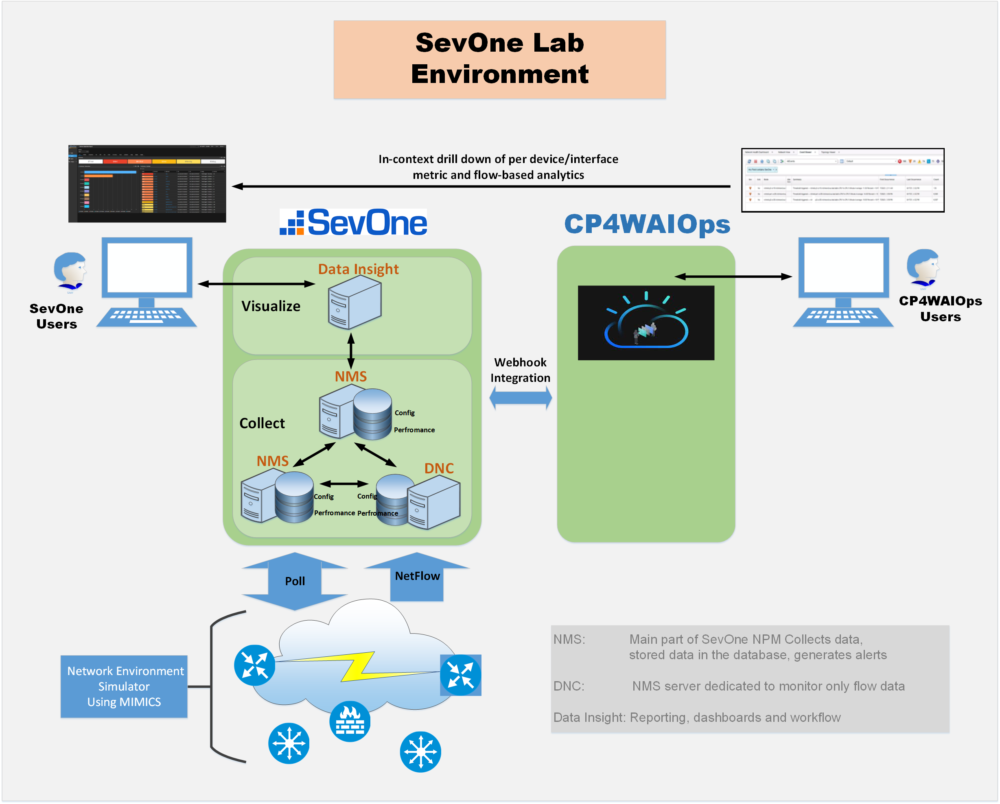
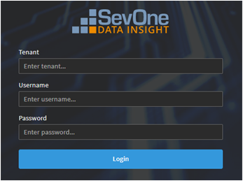
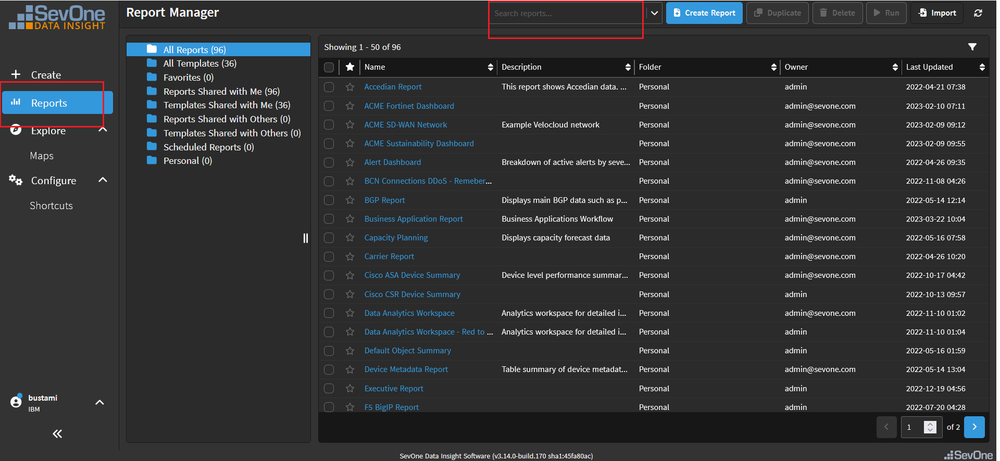

---
export const Title = () => (
  
    Lab Environment  
  
);
---
## Lab Architecture: 

Please use the link below to access the SevOne instant  
#### https://watto-di.coc-ibm.com/login

You should be presented with the following Login screen: 

Please use the following for your login:

##### Username: IBM
##### Username: (Instructor Provided)
##### Password: (Instructor Provided)

Most of the Labs will start by accessing the associated SevOne Report. 
After a successful login, select the “Reports” option from the left menu, and then enter the requested report name in the “Search reports” box from the top. 

