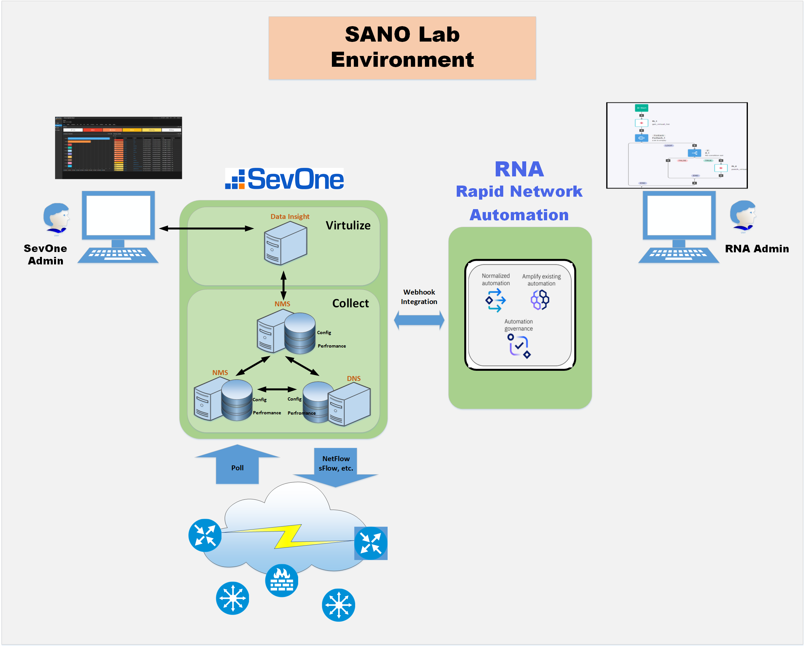

export const Title = () => (
  
    Lab Environment  
  
);
;

## Lab Architecture: 

Please use the link below to access the SevOne instant  
#### https://watto-di.coc-ibm.com/login

You should be presented with the following Login screen: 

Please use the following for your login:

##### Tenant: Partner
##### Username: (partner email)
##### Password: (partner password)

** Please note:  Partner access to this environment is setup prior to the workshop. Instructions are emailed to each partner on accessing environment and resetting password.  (An IBMer must assist partners with gaining access to this IBM CoC Environment)

Most of the Labs will start by accessing the associated SevOne Report. 
After a successful login, select the “Reports” option from the left menu, and then enter the requested report name in the “Search reports” box from the top. 
