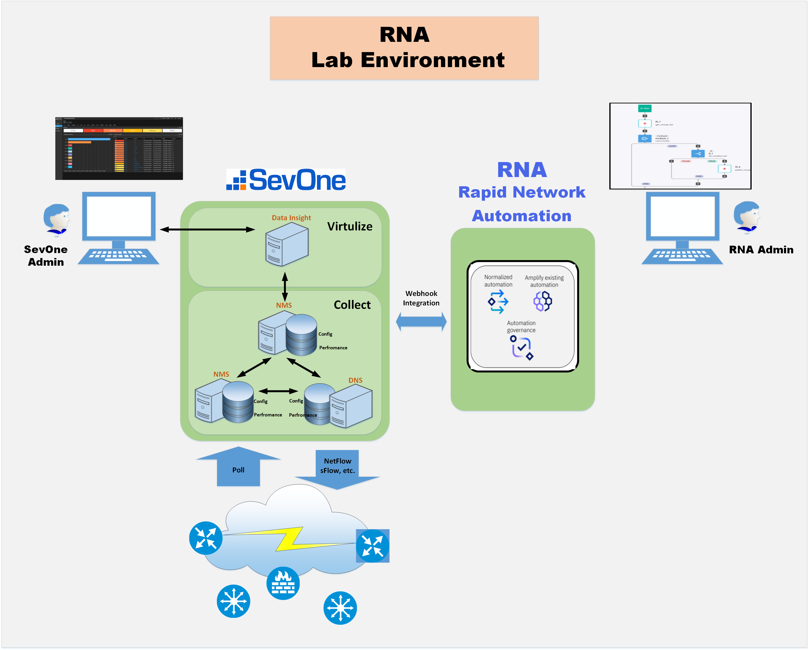
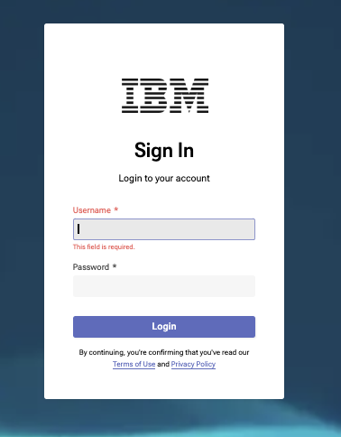

export const Title = () => (
  
    Lab Environment  
  
);
;

## RNA Lab Architecture: 

#### Please use the link provided by the instructor to access your RNA Lab Environment instance. 

   (The link will be similar to the following)
   https://na4.services.cloud.techzone.ibm.com:(PORT-NUMBER) 

You should be presented with the following Login screen: 

Use the following credential to login:

##### Username: admin
##### Password: pl1anTAut0m8tion

** Note: Access to this environment is setup prior to the workshop. Instructions and links are emailed to each partner on accessing RNA lab environments. (Parners and IBMers can spin-up their own environments using the following IBM TechZone Environment - https://techzone.ibm.com/collection/641b10044aa54a0018326031)

After a successful login, please move to the next lab(RNA Lab 1)