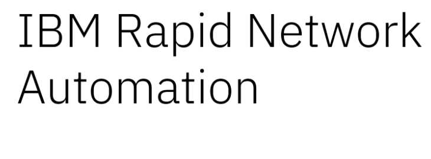

export const Title = () => (
  
    SANO Workshop Presentations  
  
);
;

<Row>
<Column colMd={4} colLg={4} noGutterMdLeft>
<ArticleCard
  title="SevOne Overview"
  href="https://ibm.box.com/s/yhk0niu0xm2irh42uvjf6av4r94eetub"
  actionIcon="arrowRight"
>

</ArticleCard>
</Column>

<Column colMd={4} colLg={4} noGutterMdLeft>
<ArticleCard
  title="SevOne Themes and Roadmap"
  href="https://ibm.box.com/s/ukwejsx61coavupgglm9fpshfml8ng4d"
  actionIcon="arrowRight"
>

</ArticleCard>
</Column>
<Column colMd={4} colLg={4} noGutterMdLeft>
<ArticleCard
  title="SevOne Pricing and Packaging"
  href="https://ibm.box.com/s/cru7nx9ow15sje19qwfs1fgu66w24f31"
  actionIcon="arrowRight"
>

</ArticleCard>
</Column>

<Column colMd={4} colLg={4} noGutterMdLeft>
<ArticleCard
  title="SevOne Competitive Advantage"
  href="https://ibm.box.com/s/85incs6zyaob49mfdm4xdsqtjct7ziz8"
  actionIcon="arrowRight"
>

</ArticleCard>
</Column>

<Column colMd={4} colLg={4} noGutterMdLeft>
<ArticleCard
  title="SevOne Customer Success Stories"
  href="https://ibm.box.com/s/7cnp9pfqp280yi4e8ohrl9d9aa71pksb"
  actionIcon="arrowRight"
>

</ArticleCard>
</Column>

<Column colMd={4} colLg={4} noGutterMdLeft>
<ArticleCard
  title="Why Rapid Network Automation"
  href="https://ibm.box.com/s/qnoxuupoq3va9mdw53kfq7rxnqx97ur1"
  actionIcon="arrowRight"
>

</ArticleCard>
</Column>

<Column colMd={4} colLg={4} noGutterMdLeft>
<ArticleCard
  title="Product Overview & Architecture"
  href="https://ibm.box.com/s/ymuhiiwch96yhiqmgd10kqmmnmeh3eta"
  actionIcon="arrowRight"
>

</ArticleCard>
</Column>

<Column colMd={4} colLg={4} noGutterMdLeft>
<ArticleCard
  title="Product Installation"
  href="https://ibm.box.com/s/p2m9hyt9ch04n0mgcp1oerewaz4bpmps"
  actionIcon="arrowRight"
>

</ArticleCard>
</Column>

<Column colMd={4} colLg={4} noGutterMdLeft>
<ArticleCard
  title="Product UI Overview and Demo"
  href="https://ibm.box.com/s/91d0682pqgxia9kr1ny35jbc2kkt0519"
  actionIcon="arrowRight"
>

</ArticleCard>
</Column>

<Column colMd={4} colLg={4} noGutterMdLeft>
<ArticleCard
  title="Competitive Advantages"
  href="https://ibm.box.com/s/4r5tqvjr8ra2wrmh1e5delgj1dc654p6"
  actionIcon="arrowRight"
>

</ArticleCard>
</Column>

<Column colMd={4} colLg={4} noGutterMdLeft>
<ArticleCard
  title="Pricing and Deployment Options"
  href="https://ibm.box.com/s/0g79utnuly4hsbqp5cpi0unnvnxibiav"
  actionIcon="arrowRight"
>

</ArticleCard>
</Column>
</Row>