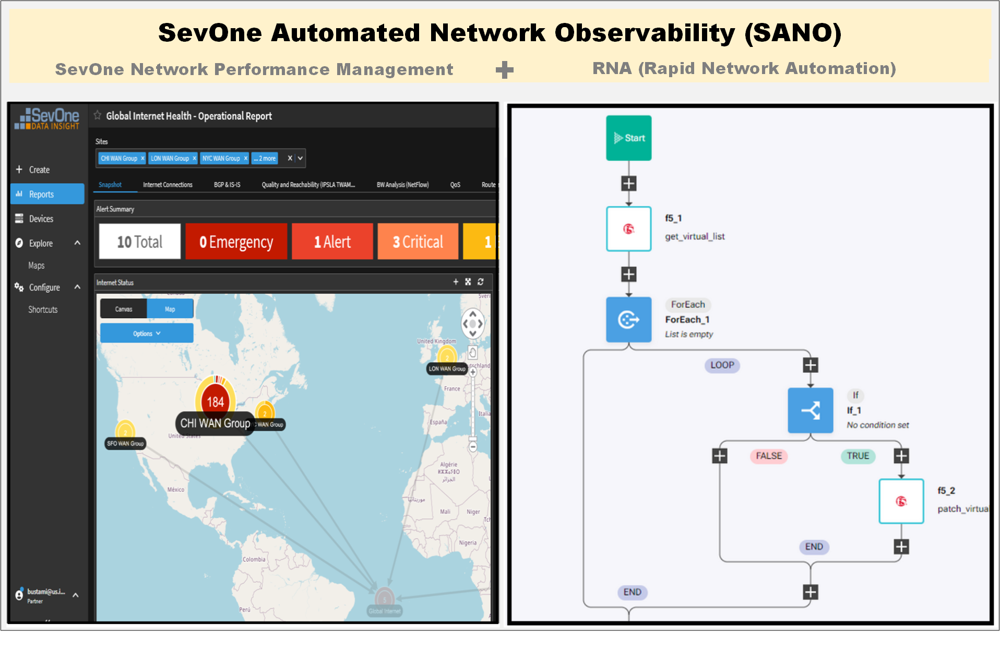

import HomepageTemplate from '../components/Homepage.js';
export default HomepageTemplate;

## What is SevOne?

<PageDescription>

The IBM® SevOne Network Performance Management solution helps you spot, address, and prevent network performance issues early with machine learning-powered
 analytics from a single source.. See more at IBM's [SevOne Website](https://www.ibm.com/cloud/sevone-network-performance-management).

</PageDescription>

<ArtDirection>

</ArtDirection>

